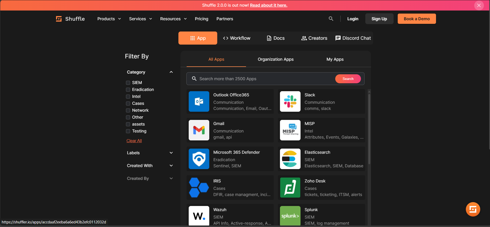

# Quickstart

## Installation Overview

There are multiple ways to install **Singul** on systems running **Microsoft Windows**, **Apple macOS**, or various flavors of **Linux**.

The **Singul Python SDK** is distributed via **PyPI**, making it easy to install using pip:

```bash
pip install shufflepy
```

### Using Singul with an App

To use Singul with a specific app (like Jira, Outlook, TheHive, etc.), follow these steps:

#### Find Your App

Browse available apps supported by Shuffle:[Search for apps here](https://shuffler.io)

<figure><figcaption></figcaption></figure>

You’ll find integrations for tools like:

* Jira
* Gmail
* Outlook
* GitHub
* TheHive
* And many more!

***

### Add & Authenticate the App

1. Go to [shuffler.io](https://shuffler.io)
2. Log in to your account
3. Find the app you want to use
4. **Click "Add App"**
5. Provide your credentials or API tokens for the app

***

### Use the App with Singul SDK

After authenticating your app in Shuffle, you can now fetch data or trigger actions from Python using Singul.

### Example: Fetch Jira Tickets

Here’s a **classical example** of how to use the Singul SDK to list tickets from an app like **Jira**, **GitHub**, or any other supported case/ticketing platform.

```python
from shufflepy import Singul

# Initialize Singul SDK with your API key and base URL
singul = Singul(api_key="YOUR_API_KEY", base_url="https://singul.io")

try:
    # Call the list_tickets action from the Cases module
    responses = singul.cases.list_tickets(
        app="jira",               # Replace with your app name
        auth_id="YOUR_ORG_AUTH_ID"  # Replace with your app's auth ID from Shuffle
    )

    # Print the response
    print(responses)

except Exception as e:
    print(f"An error occurred: {e}")
```

#### Notes:

* `app`: The app you're connecting to (e.g., `"jira"`, `"github"`, `"thehive"`)
* `auth_id`: The **Organization Authentication ID** you set up for this app in [shuffler.io](https://shuffler.io)

***

### Authentication Reminder

Make sure your app is:

* **Added and authenticated** in your Shuffle dashboard
* You're using the correct **auth ID** from that app’s integration
